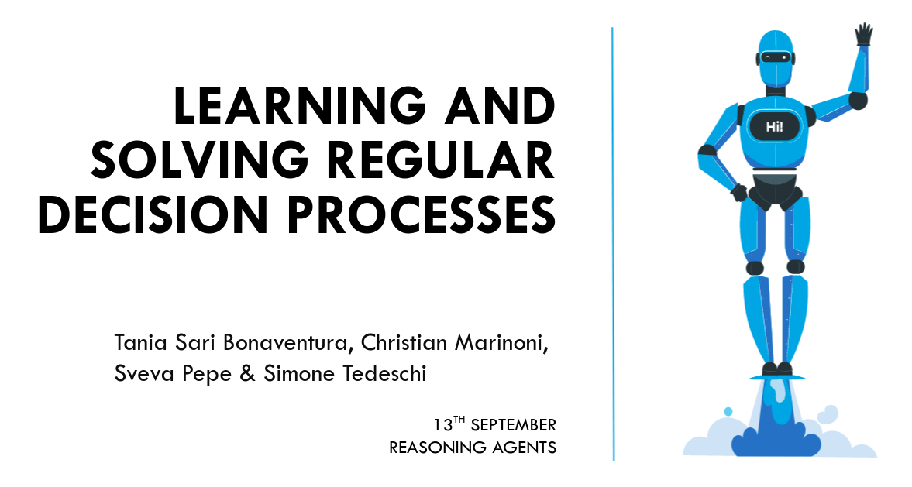

# Regular-Decision-Processes

## Table of contents

* [Development Setup](#Development-Setup)
* [Requirements](#Requirements)
  * [Download the glove data](#Download-the-glove-data)
  * [Run](#Run)
* [Github Pages](#Github-Pages)
* [Report](#Report)
* [Slides](#Slides)

### Development Setup

<p align="center">
  
</p>

### Requirements

```
$ conda create --name rdp python=3.8.10
$ conda activate rdp
$ pip install -r requirements.txt
$ cd ./nonmarkov-envs
$ pip install .
```

### Run

``` 
$ cd ./nonmarkov-env/nonmarkov-env
$ python __main__.py --env ENV_NAME --only-mcts ONLY-MCTS --episode EPISODE --max-iterations MAX-ITERATION --min-samples MIN-SAMPLE --mixed MIXED
```

where
- `ENV_NAME` is the name of the domain, you can choose between: `CheatMAB, RotatingMAB, RotatingMaze`
- `ONLY-MCTS` choose if you want to perform only mcts algorithm, default is False
- `EPISODE` length of the episode of the env, default is 5
- `MAX-ITERATION` maximum number of iterations of the S3M algorithm, default is 4500
- `MIN-SAMPLE` minimum number of samples of the S3M algorithm, default is 100
- `MIXED` choose if you want to perform mixed S3M algorithm and MCTS saving figure, default is False


### Github Pages

<a href="https://pepes97.github.io/Regular-Decision-Processes/" target="_blank">
  
</a>

### Report

<a href="https://github.com/pepes97/Regular-Decision-Processes/blob/main/report/RDP.pdf" target="_blank">
   
</a>

### Slides

<a href="https://docs.google.com/presentation/d/e/2PACX-1vQ9cK2ABjeM17yF9tYKtDtj0tjliVS2fFp3V6XKZAN9G9jS3etlh_Uqaskk6GBUxQ/embed?start=false&loop=false&delayms=60000#slide=id.p1" target="_blank">

</a>
<center>
