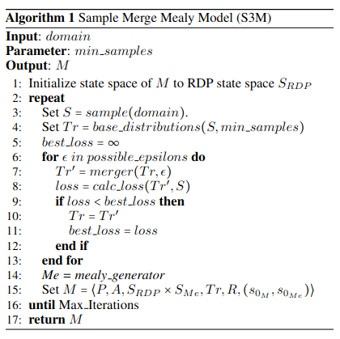
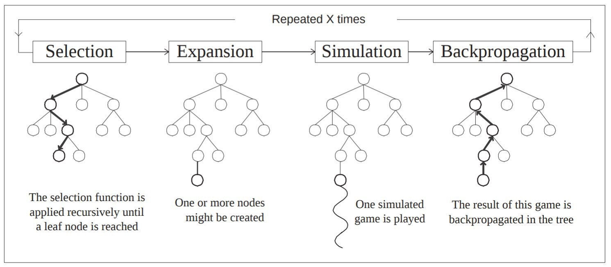
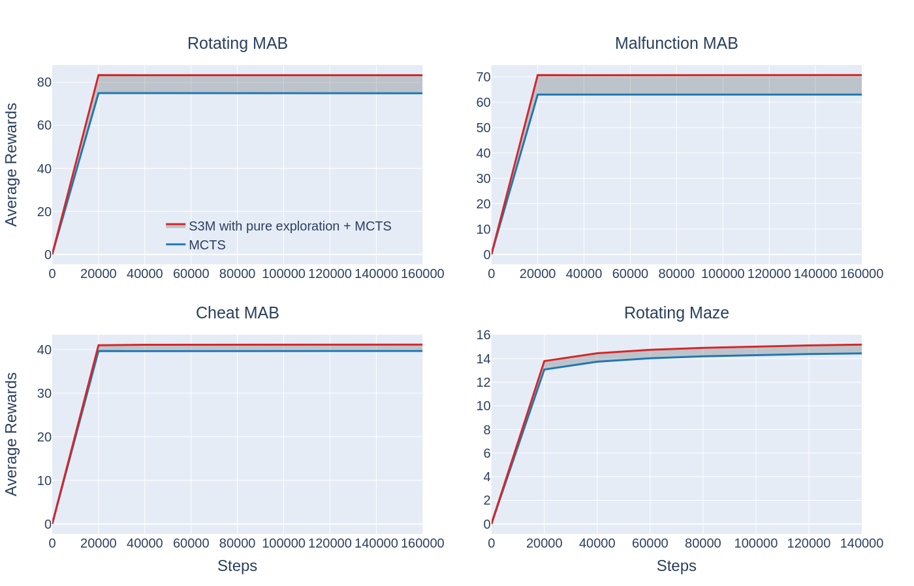
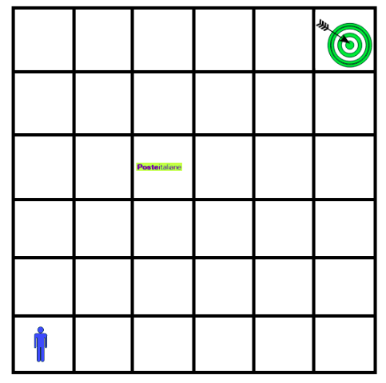

# Introduction

Regular Decision Processes (RDPs) have
been recently introduced as a non-Markovian extension of
MDPs that does not require knowing or hypothesizing a hidden
state. An RDP is a fully observable, non-Markovian model in
which the next state and reward are a stochastic function of the
entire history of the system. However, this dependence on the
past is restricted to regular functions. That is, the next state
distribution and reward depend on which regular expression
the history satisfies. An RDP can be transformed into an MDP by extending
the state of the RDP with variables that track the satisfaction of the regular expression governing the RDP dynamics.
Thus, essentially, to learn an RDP, we need to learn these
regular expressions. 

The works of Abadi and Brafman [(Abadi and Brafman, 2020)](https://www.ijcai.org/proceedings/2020/270) and Ronca and De Giacomo [(Ronca and De Giacomo, 2021)](https://arxiv.org/abs/2105.06784) provide two significant contributions to the analysis and solution of RDPs.  
The first work focuses on the use of a deterministic Mealy Machine to specify the RDP where, for each state-action pair, a cluster is emitted. Each cluster has an associated distribution over the system states and reward signal. Then, they formulate the first algorithm to learn RDPs from data that merges histories with similar distributions to generate the best model from which the Mealy Machine is produced.
Finally, the latter is exploited to provide the distributions needed for running MCTS [(Kocsis and Szepesvári, 2006)](https://link.springer.com/chapter/10.1007/11871842_29), [(David et all., 2010)](https://dspace.mit.edu/handle/1721.1/100395).
Four domains (i.e., `RotatingMAB`, `CheatMAB`, `MalfunctionMAB` and `RotatingMaze`) are used for the evaluation.

On the other hand, the second work shows an algorithm that learns a probabilistic deterministic finite automaton (PDFA) that represents RDP. Then, it computes an intermediate policy by solving the MDP obtained from the PDFA. From such policy, the final one is derived by composing it with the transition function of the PDFA. The whole process, repeated multiple times, ensures to reach an $\epsilon$-optimal policy in polynomial time. 

Our project consists of the implementation of the algorithm provided by [(Abadi and Brafman, 2020)](https://www.ijcai.org/proceedings/2020/270) without considering propositions while trying to reproduce the same results as the authors.

# Preliminaries
* Markov Decision Process
* Non-Markovian Decision Process
* Regular Decision Process
* Deterministic Mealy Machine

# Algorithm

The Abadi and Branfam algorithm, called *Sample Merge Mealy Model* (S3M), follows these steps:

* **Sampling**: it generates traces from the RDP by interacting with the environment
* **Base distribution**: it associates a distribution over the states to each history derived from the traces.
* **Merger**: it merges the distributions of multiple histories based on the Kullback-Leibler divergence.
* **Loss function**: it allows to select the best model, penalizing the ones with the few merges and too high support.
* **Mealy Machine**: it generates the Mealy Machine from the computed model 

# Monte Carlo Tree Search

*Monte  Carlo  Tree  Search*  (MCTS)  uses  Monte  Carlo  simulation  to  accumulate  value  estimates to guide towards highly rewarding paths in the search tree.  In other words,  MCTS pays more attention  to  nodes  that  are  more  promising,  so  it  avoids  having  to  brute  force  all  possibilities which is impractical to do.

At its core, MCTS consists of 4 steps:
* **Selection**:  the algorithm keeps selecting the best child nodes until a leaf node of the treeis reached.
* **Expansion**:  then, from the leaf node the algorithm randomly picks an unexplored node.
* **Simulation**:  after Expansion, the algorithm simulates an entire episode from the selected node by picking a sequence of random actions until the episode ends
* **Backpropagation**:  finally, it evaluates the reached state to figure out if the agent won ornot.  It traverses upwards to the root and updates the win score of each node based on the (winning or loosing) final state reached by the agent

# Setup Environment

We  implemented  our  code  in  Python  and  we  relied  on  the  FlexFringe2library  to  generate  theMealy Machine.  We evaluated our algorithm on four different domains, belonging to 2 families:Non Markovian Multi-Arm Bandit (MAB) and Rotating Maze.

# Results

we compare two setups for each domain: i) only MCTS ii) S3M algoritm with pure exploration policy + MCTS, so to verify the effectiveness of the algorithm proposed by Abadi and Brafman.  The outcomes are depicted in following Figure.  We illustrate the average reward collected by the first two algorithms during learning.  Fifty trials were carried out using the currently learned Mealy Machine.  MAB trials were ten steps (episode) long, while Maze trials terminated after 15 steps if the agent did not meet the goal.  Except for the CheatMAB, Random Sampler performspretty well, although its cumulative reward is generally significantly lower.  A deeper examination of  the  Maze  domain  reveals  that  the  performance  difference  is  what  we  would  anticipate  if  we disregard  non-Markovian  behaviour—the  margin  is  less  than  in  the  MAB  domains.   In RL, proper exploration is crucial.  In RDPs,  exploring states is not enough;  we also need to collectstatistics on histories.  It is fascinating to compare the results of the two techniques in this aspect. In all of the graphs, we can see how the S3M method, based solely on pure exploration, contributes more than the only MCTS approach.  In particular, we can see how the difference between thetwo algorithms in the MAB domains is more pronounced, but the results in the MAZE are pretty similar, but this is due to the complexity of the domain itself.  In the next section, we will look atwhy S3M can provide benefits and what we consider to be the most significant factors that allow S3M to outperform the single MCTS.

# Analysis

Our S3M performance analysis mainly focused on the RotatingMAB domain, which is the simplestof those proposed.  In actuality, it is defined by only two states - losing (0,) and winning (1,) - forwhich the agent receives a zero or full reward.  A Mealy Machine should theoretically get closerto the ideal with each iteration of S3M, as explained in the Section 3.  For this reason, it is crucialto know which Mealy Machine we should get. Further detail in the [report](https://github.com/pepes97/Regular-Decision-Processes/blob/main/report/RDP.pdf).

# Complex Domain

We created a domain similar to Rotating Maze but proved exceedingly challenging for both theS3M  and  PAC-RL  algorithms.   It  is  made  out  of  a  grid  domain  that  contains  the  agent,  his “opponent”, and the goal that the agent must achieve.  The Figure below shows our domain in the initial situation. The antagonist moves at each agent's action toward one of the four surrounding cells according to a distribution.
The rotation of the grid depends on the moves of both the agent and its antagonist. More precisely, the grid rotates every n chosen actions, with n >=5 , just as it does in the Rotating Maze. If the agent goes in the same cell of its opponent the algorithm will start over and the agent will be forced to try again to reach the goal.

# Credits

* [Tania Sari Bonaventura](https://github.com/tsarib)

* [Christian Marinoni](https://github.com/chrismarinoni)

* [Sveva Pepe](https://github.com/pepes97)

* [Simone Tedeschi](https://github.com/sted97)

# References

* [Abadi and De Giacomo. Planning for LTLf /LDLf Goals in Non-Markovian Fully Observable Nondeterministic Domains. 2019](https://doi.org/10.24963/ijcai.2019/222)

* [Abadi and Brafman. Learning and Solving Regular Decision Processes. 2020](https://doi.org/10.24963/ijcai.2020/270)

* [Ronca and De Giacomo. Efficient PAC Reinforcement Learning in Regular Decision Processes. 2021](https://doi.org/10.24963/ijcai.2021/279)

